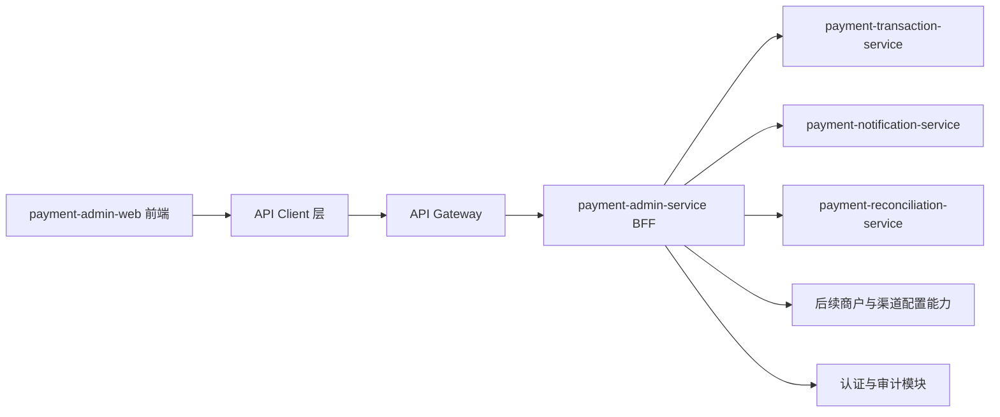
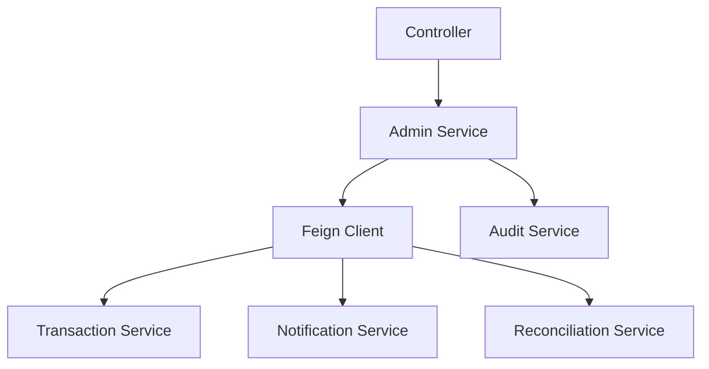
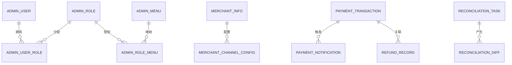

## 1. 架构设计



## 2. 技术说明
- 前端：Vue 3 + TypeScript + Vite + Tailwind CSS + Vue Router
- 初始化方式：`vite-init` 的 `vue-ts` 模板
- 组件方向：自定义业务组件 + `lucide-vue-next` 图标
- 请求层：统一 `fetch` 封装，处理 token 注入、错误提示、401 跳转、分页查询参数
- 状态管理：登录态优先使用组合式会话封装，复杂筛选与模块状态再按需抽 composable
- 后端：保留现有 Spring Boot 微服务体系，由 `payment-admin-service` 作为后台 BFF

## 3. 路由定义
| 路由 | 用途 |
|-------|---------|
| /login | 后台登录页 |
| /dashboard | 后台控制台首页 |
| /merchants | 商户列表与管理 |
| /transactions | 交易中心 |
| /refunds | 退款中心 |
| /notifications | 通知中心 |
| /reconciliations | 对账中心 |
| /system | 系统管理 |

## 4. API 定义

### 4.1 通用响应结构
```ts
export interface ApiResponse<T> {
  code: string | number
  message: string
  data: T
  traceId?: string
}

export interface PageResult<T> {
  records: T[]
  total: number
  current: number
  size: number
}
```

### 4.2 登录相关
```ts
export interface AdminLoginRequest {
  username: string
  password: string
}

export interface AdminLoginResponse {
  token: string
  refreshToken?: string
  userName: string
  displayName: string
  roles: string[]
  permissions: string[]
}
```

### 4.3 商户相关
```ts
export interface MerchantSummary {
  merchantId: string
  merchantName: string
  status: string
  notifyUrl: string
  createdAt: string
}
```

### 4.4 交易相关
```ts
export interface AdminTransactionItem {
  transactionId: string
  orderId: string
  merchantId: string
  amount: number
  currency: string
  paymentMethod: string
  status: string
  providerTransactionId?: string
  createdAt: string
  paidAt?: string
}
```

### 4.5 通知相关
```ts
export interface AdminNotificationItem {
  id: number
  transactionId: string
  notifyUrl: string
  notificationStatus: string
  retryCount: number
  maxRetry: number
  nextRetryAt?: string
  lastHttpStatus?: number
  failureReason?: string
  notifiedAt?: string
  createdAt: string
}
```

## 5. 服务端架构图



## 6. 数据模型

### 6.1 数据模型定义


### 6.2 数据定义语言
- 现有 `payment_admin_db` 保留 `merchant_info` 与 `merchant_channel_config`
- 需要新增后台鉴权与审计表：
  - `admin_user`
  - `admin_role`
  - `admin_menu`
  - `admin_user_role`
  - `admin_role_menu`
  - `admin_audit_log`
- 前端不直连数据库，所有数据都经由 `payment-admin-service` 聚合输出

## 7. 实施原则
- 前后端分离：新增独立工程 `payment-admin-web`
- 网关统一入口：前端只访问网关，不直连微服务
- DTO 优先：管理后台接口统一返回清晰 DTO，不用 `Map`
- 页面聚合：前端只关心后台业务视图，不暴露底层服务细节
- 可观测性：所有后台操作必须带 `traceId`，关键动作落审计日志
- Controller 拆分：单一边界上下文可以先保留单 Controller；一旦同时承接外部协议、内部管理、批处理命令，就按调用方和职责拆分
