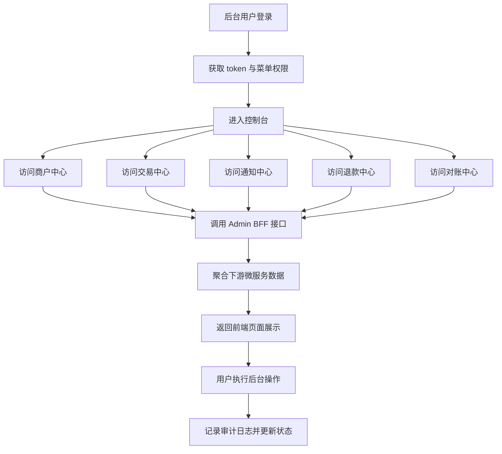

## 1. 产品概述
该项目需要新增一个独立的后台管理前端 `payment-admin-web`，采用 `Vue 3 + TypeScript + Vite` 编写，并与现有微服务后端彻底前后端分离。
- 主要服务对象为运营、财务、客服、运维人员，用于查交易、管商户、看通知、做对账和执行后台操作。
- 产品目标是把当前分散在多个微服务里的能力，以统一后台工作台的形式沉淀成可演示、可运维、可扩展的支付中台控制台。

## 2. 核心功能

### 2.1 用户角色
| 角色 | 登录方式 | 核心权限 |
|------|----------|----------|
| 超级管理员 | 后台账号密码登录 | 管理全部菜单、角色、商户、渠道、交易和系统配置 |
| 运营人员 | 后台账号密码登录 | 查看交易、处理通知、管理商户基础信息 |
| 财务人员 | 后台账号密码登录 | 查看退款、对账批次、差错记录、导出报表 |
| 客服人员 | 后台账号密码登录 | 查询订单、查看时间线、执行关单与重试 |

### 2.2 功能模块
1. **登录页**：账号登录、系统介绍、环境标识、登录态校验
2. **控制台页**：核心指标、趋势卡片、异常告警、快捷入口
3. **商户中心页**：商户列表、商户详情、创建商户、冻结解冻、重置密钥
4. **交易中心页**：交易分页、条件筛选、详情抽屉、状态时间线、关单、重试
5. **通知中心页**：通知记录分页、失败状态查看、响应体查看、手工重发
6. **对账中心页**：对账批次列表、差错明细、触发对账、异常标记
7. **退款中心页**：退款记录、退款详情、按交易号过滤、取消退款
8. **系统管理页**：用户、角色、菜单、审计日志、系统参数

### 2.3 页面明细
| 页面名称 | 模块名称 | 功能说明 |
|-----------|-------------|---------------------|
| 登录页 | 登录卡片 | 输入账号密码，提交后写入 token、用户信息、菜单权限 |
| 登录页 | 环境提示 | 展示当前环境、网关地址、系统说明 |
| 控制台页 | 指标总览 | 展示支付总额、成功率、通知失败数、待处理差错数 |
| 控制台页 | 趋势图表 | 展示 7 日交易趋势、渠道占比、状态分布 |
| 商户中心页 | 商户列表 | 支持分页、搜索、启停状态过滤 |
| 商户中心页 | 商户详情 | 展示基础信息、渠道配置、回调地址、密钥信息 |
| 商户中心页 | 操作面板 | 支持创建、冻结、解冻、重置密钥 |
| 交易中心页 | 条件筛选 | 支持 transactionId、orderId、merchantId、状态、支付方式、时间范围 |
| 交易中心页 | 列表表格 | 展示交易状态、金额、渠道单号、创建时间、支付时间 |
| 交易中心页 | 详情抽屉 | 展示交易详情、状态轨迹、回调记录、退款记录 |
| 交易中心页 | 操作区 | 提供强制关单、手工重试 |
| 通知中心页 | 通知列表 | 展示通知状态、重试次数、下一次重试时间、失败原因 |
| 通知中心页 | 响应查看 | 弹窗查看最后响应体、HTTP 状态码、失败原因 |
| 通知中心页 | 手工重发 | 单条触发重新发送通知 |
| 对账中心页 | 批次列表 | 展示批次号、状态、差错数、创建时间 |
| 对账中心页 | 差错明细 | 展示长款、短款、状态不一致明细和处理备注 |
| 退款中心页 | 退款列表 | 展示退款单状态、金额、原因、创建时间 |
| 系统管理页 | 权限管理 | 展示用户、角色、菜单、操作日志 |

## 3. 核心流程
后台用户先登录系统，随后根据角色进入相应工作台；系统通过 `payment-admin-service` 聚合交易、通知、退款、对账等微服务数据，并在前端统一展示与操作。前端路由、鉴权守卫、请求拦截、错误提示都在独立 Vue 工程内维护，不直接暴露下游服务细节。

## 4. 用户界面设计
### 4.1 设计风格
- 主色调：深海军蓝、石墨灰、冷白色，辅以少量青绿高亮
- 按钮风格：圆角矩形、轻微浮层、强状态色区分危险操作
- 字体风格：标题使用更有辨识度的中文展示字体，正文使用易读的现代中文无衬线字体
- 布局风格：桌面优先的左侧导航 + 顶部信息条 + 内容工作区
- 图标风格：线性图标为主，关键告警使用强对比色标签

### 4.2 页面设计概览
| 页面名称 | 模块名称 | UI 元素 |
|-----------|-------------|-------------|
| 登录页 | 品牌区 | 深色渐变背景、系统标题、功能说明、环境徽标 |
| 登录页 | 表单区 | 居中卡片、清晰标签、登录反馈、按钮动效 |
| 控制台页 | 概览卡片 | 大数字、状态徽章、趋势箭头、微动画 |
| 控制台页 | 图表区 | 深浅分层卡片、折线图、环形图、悬浮提示 |
| 列表页 | 查询区 | 紧凑筛选栏、统一输入宽度、状态下拉与时间选择器 |
| 列表页 | 表格区 | 斑马行、状态彩色标签、操作按钮分组 |
| 详情页 | 抽屉区 | 信息分段、时间线、JSON 查看器、响应日志块 |

### 4.4 前端工程约束
- 使用 `Vue Router` 管理后台页面路由
- 使用 Composition API + `script setup` 组织页面与复用逻辑
- 请求层统一封装在 `src/services`
- 登录态使用前端会话存储管理，后续可平滑切换到真实 JWT / RBAC
- 所有危险操作必须有二次确认和结果回显

### 4.3 响应式
- 采用桌面优先设计
- 在 1440px 以上保证完整运营台布局
- 在 1024px 左右折叠部分边栏
- 小屏仅保证基础浏览，不优先适配复杂运营操作
